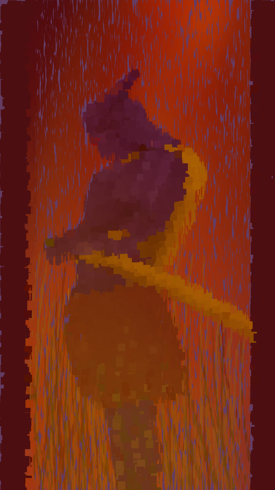
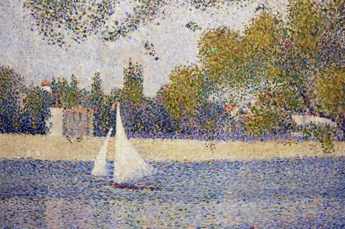
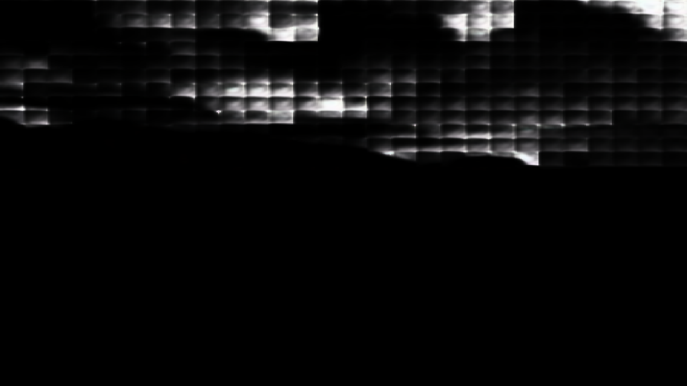
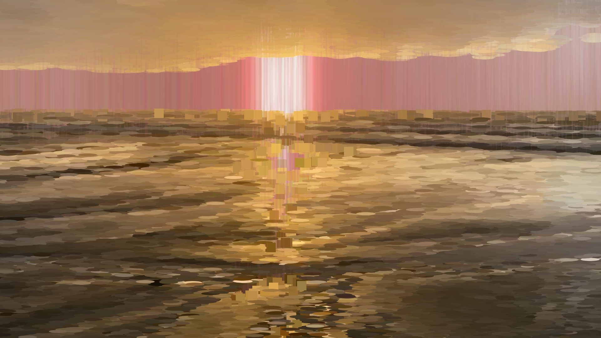

## Creative Coding 2: Custom Pixel Ai-camera

### Light And Horizon
#### By Lliam Booth

I began this project unsure of what theme I wanted to persue my initial idea for a theme was some how repressenting the emotions or feelings of people or perhaps representing the character of a place I decided against these courses as I felt they were to vague and conceptial in nature and would not work well with the use of AI
my first work inside the code base was to familiarise my self with it in that time I produced the following image  by using squares and stretched ellipse. I knew at this stage i wanted to primarily use beach side sunset images and loaded several in for general asthetic experiments

the visual style I would proceed with was Inspired in part by the work of pointalist painter Georges Seurat especially his landscapes Georges Seurat, The river Seine at La Grande-Jatte, 1888
(Photo: Fin-de-Siècle Museum via Wikimedia Commons, Public domain)

I was also inspired by the streak pointalist style that characterise many of Van Goghs works Self-Portrait with Straw Hat, Paris, Winter 1887–88. Metropolitan Museum of Art, New York

these inspirations would form the basis of the asthetic style I was looking for in the final product I experimented with different sizes and shapes an eventually settled on larger and more numerous points. at this stage I still did not have a solid concept for my theme eventually I thought of the idea of sea and sky this would evolve further into the final theme of Light and Horizon as my experiments continued.
while I was sick i came up with a new theme concept i wondered what the results would be if you gave the AI a data set that did not corrispond to the images you wanted it to alter i followed this "baddata" theme idea until it became clear that the AI was not able to interprate much of anything even with images that matched mixed with the bad this was the best mask this idea produced. this made me return to the idea of light and horizon and i would begin tinkering with using the image pixel colour to influence the shape type further wanting to create visual interest around the primary light source the sun. this would result in a happy accident where rather than using the RGB value of the pixel colour I used the GBA which created a highly interesting and almost psychidelic colour with after streching the ellipses resulted in this final asthetic